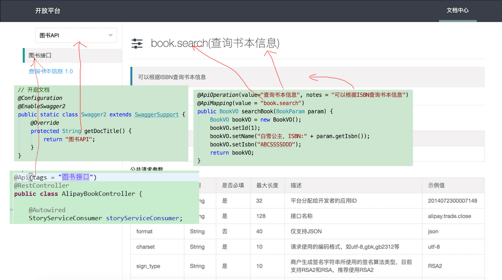

# 编写文档

作为开放平台，必须要提供API文档。

SOP采用微服务架构实现，因此文档应该由各个微服务各自实现。难点就是如何统一归纳各个微服务端提供的文档信息，并且统一展示。

写完接口后使用swagger注解来定义自己的文档信息。步骤如下：

- maven添加swagger

```xml
<!-- swagger2 -->
<dependency>
    <groupId>io.springfox</groupId>
    <artifactId>springfox-swagger2</artifactId>
    <version>2.9.2</version>
</dependency>
<dependency>
    <groupId>com.github.xiaoymin</groupId>
    <artifactId>swagger-bootstrap-ui</artifactId>
    <version>1.9.5</version>
</dependency>

```

- 在config中添加swagger配置

```java
@Configuration
public class OpenServiceConfig extends AlipayServiceConfiguration {
    /**
     * 开启文档，本地微服务文档地址：http://localhost:2222/doc.html
     * http://ip:port/v2/api-docs
     */
    @Configuration
    @EnableSwagger2
    public static class Swagger2 extends SwaggerSupport {
        @Override
        protected String getDocTitle() {
            return "故事API";
        }
    }
}
```

其中`getDocTitle()`返回文档模块名，不能和其它微服务重复。比如订单服务返回：`订单API`；库存服务返回：`库存API`

- 编写swagger注解

分别在请求参数和返回结果类中编写`@ApiModelProperty`

```java
// 请求参数
@Data
public class StoryParam {
    @ApiModelProperty(value = "故事ID", example = "111")
    private int id;

    @ApiModelProperty(value = "故事名称", required = true, example = "白雪公主")
    private String name;
}

// 返回结果
@Data
public class StoryResult {
    @ApiModelProperty(value = "故事ID", example = "1")
    private Long id;

    @ApiModelProperty(value = "故事名称", example = "海底小纵队")
    private String name;

    @ApiModelProperty(value = "创建时间", example = "2019-04-14 19:02:12")
    private Date gmt_create;
}
```

- 在接口方法上编写`@ApiOperation`注解

```java
/**
 * 参数绑定
 *
 * @param story 对应biz_content中的内容，并自动JSR-303校验
 * @return
 */
@ApiOperation(value = "获取故事信息", notes = "说明接口的详细信息，介绍，用途，注意事项等。")
@Open(value = "alipay.story.find", bizCode = {
     // 定义业务错误码，用于文档显示
     @BizCode(code = "100001", msg = "姓名错误", solution = "填写正确的姓名"),
     @BizCode(code = "100002", msg = "备注错误", solution = "填写正确备注"),
 })
public StoryResult getStory2(StoryParam story) {
    log.info("获取故事信息参数, story: {}", story);
    // 获取其它参数
    OpenContext openContext = ServiceContext.getCurrentContext().getOpenContext();
    String app_id = openContext.getAppId();
    StoryResult result = new StoryResult();
    result.setName("白雪公主, app_id:" + app_id);
    result.setGmt_create(new Date());
    return result;
}
```

其中`value`属性填接口名称，简明扼要。`notes`填写接口的详细信息，介绍，用途，注意事项等。

## 查看文档

- 确保注册中心、网关、微服务正常启动
- 运行WebsiteServerApplication.java
- 访问http://localhost:8083

效果图如下


## 注解对应关系

swagger注解和文档界面显示关系如下图所示：




