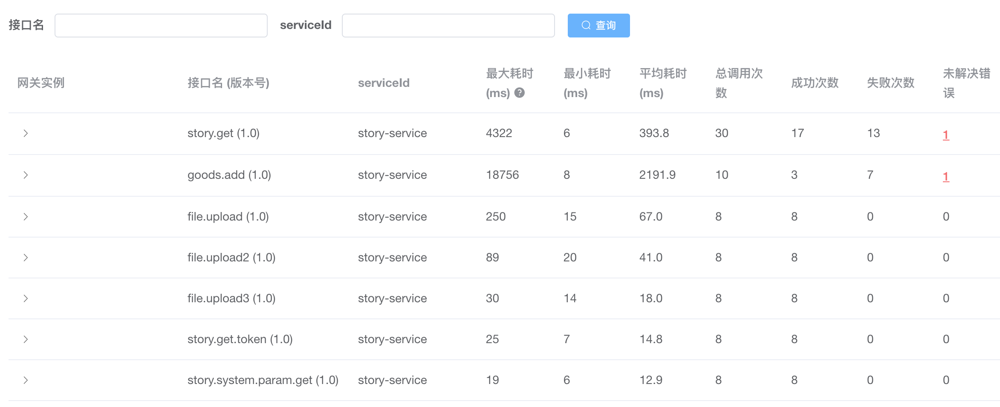
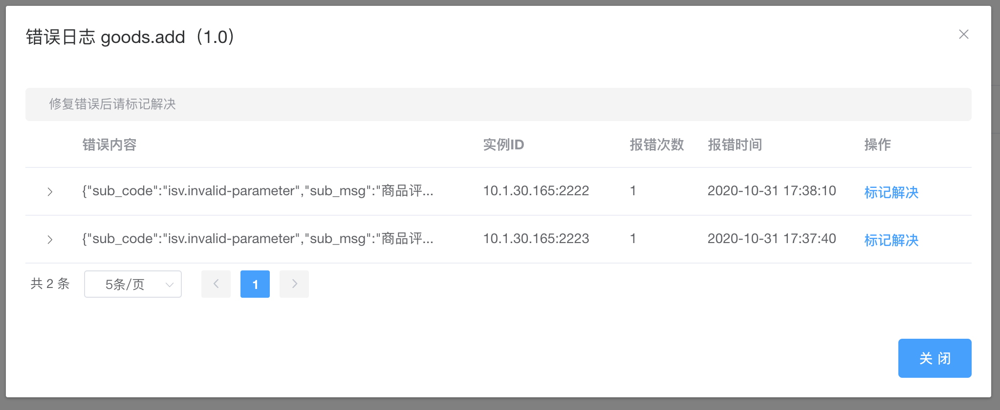

# 路由监控

路由监控功能可以查看各个接口的调用情况，监控信息收集采用拦截器实现。

- 统计各个接口的调用次数、耗时等信息
- 错误日志统一在网关负责收集
- 只收集未知类型的错误日志，开发人员主动throw的异常不收集
- 收集的日志存放在内存中，重启网关日志会消失

## 永久保存日志

默认收集的日志存放在内存中，重启网关日志会消失（见：`com.gitee.sop.gatewaycommon.monitor.MonitorManager.java`）。如果要永久保存日志内容，需要自己修改`MonitorManager`

- 后台预览

相关类：

- com.gitee.sop.gatewaycommon.interceptor.MonitorRouteInterceptor
