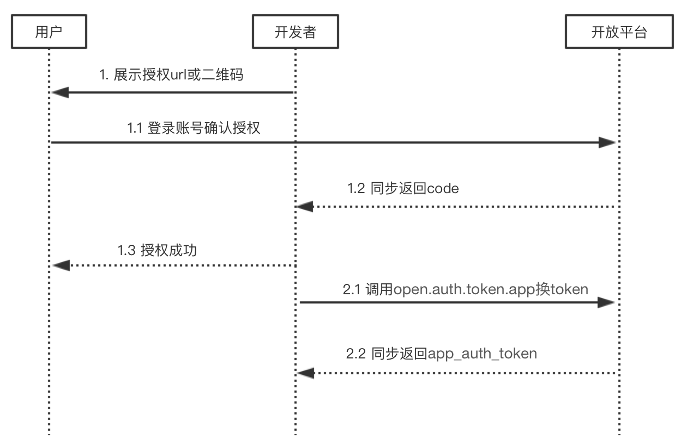

# 应用授权

## 概述

- 1、用户对开发者进行应用授权后，开发者可以帮助用户完成相应的业务逻辑。
- 2、授权采用标准的OAuth 2.0流程。

## 授权流程



## 快速接入

- 第一步：应用授权URL拼装

拼接规则:

http://openauth.yourdomain.com/oauth2/appToAppAuth?app_id=2019032617262200001&redirect_uri=http%3a%2f%2flocalhost%3a8087%2foauth2callback

参数说明：

| 参数           | 参数名称        | 类型     | 必填 | 描述            | 范例                       |
|--------------|-------------|--------|----|---------------|--------------------------|
| app_id       | 开发者应用的AppId | String | 是  | 开发者应用的AppId   | 2015101400446982         |
| redirect_uri | 回调页面        | String | 是  | 参数需要UrlEncode | http%3A%2F%2Fexample.com |

- 第二步：获取code

接口名称：open.auth.token.app

开发者通过code可以换取app_auth_token、授权用户的userId。

**注意**：应用授权的code唯一，code使用一次后失效，有效期24小时； app_auth_token永久有效。

**请求参数说明**

| 参数            | 参数名称 | 类型     | 必填 | 描述                                                                              | 范例                                       |
|---------------|------|--------|----|---------------------------------------------------------------------------------|------------------------------------------|
| grant_type    | 授权类型 | String | 是  | 如果使用code换取token，则为authorization_code，如果使用refresh_token换取新的token，则为refresh_token | authorization_code                       |
| code          | 授权码  | String | 否  | 与refresh_token二选一，用户对应用授权后得到，即第一步中开发者获取到的code值                                  | bf67d8d5ed754af297f72cc482287X62         |
| refresh_token | 刷新令牌 | String | 否  | 与code二选一，可为空，刷新令牌时使用                                                            | 201510BB0c409dd5758b4d939d4008a525463X62 |

**接口请求SDK示例**

```java
@GetMapping("oauth2callback")
@ResponseBody
public String callback(HttpServletRequest servletRequest, HttpServletResponse servletResponse) {
    String app_id = servletRequest.getParameter("app_id");
    String code = servletRequest.getParameter("code");
    OpenAuthTokenAppRequest request = new OpenAuthTokenAppRequest();
    OpenAuthTokenAppModel model = new OpenAuthTokenAppModel();
    model.setCode(code);
    model.setGrant_type("authorization_code");
    request.setBizModel(model);
    // 根据code获取token
    OpenAuthTokenAppResponse response = openClient.execute(request);
    if (response.isSuccess()) {
        // 成功拿到token，开发者在这里保存token信息
        // 后续使用token进行接口访问
        log.info("授权成功，body:{}", response.getBody());
    }
    return response.getBody();
}
```

**同步响应参数说明**

| 参数                | 参数名称    | 类型     | 必填 | 描述                                                       | 范例                               |
|-------------------|---------|--------|----|----------------------------------------------------------|----------------------------------|
| app_auth_token    | 用户授权令牌  | String | 是  | 通过该令牌来帮助用户发起请求，完成业务                                      | 856faf8d77d3b985c1073557ce6ea724 |
| user_id           | 授权用户的ID | String | 是  | 授权者id                                                    | 1                                |
| expires_in        | 令牌有效期   | Long   | 是  | 负值表示永久有效                                                 | -1                               |
| re_expires_in     | 刷新令牌有效期 | Long   | 是  | 负值表示永久有效                                                 | -3                               |
| app_refresh_token | 刷新令牌时使用 | String | 是  | 刷新令牌后，我们会保证老的app_auth_token从刷新开始10分钟内可继续使用，请及时替换为最新token | 88e68196d2359667f0dc8136e6c86803 |


**同步响应结果示例**

```json
{
    "open_auth_token_app_response": {
        "code": "10000",
        "msg": "Success",
        "app_auth_token": "88e68196d2359667f0dc8136e6c86803",
        "app_refresh_token": "856faf8d77d3b985c1073557ce6ea724",
        "expires_in": -1,
        "re_expires_in": -3,
        "user_id": "1"
    },
    "sign": "xxx"
}
```

**刷新token**

```java
OpenAuthTokenAppRequest request = new OpenAuthTokenAppRequest();
OpenAuthTokenAppModel model = new OpenAuthTokenAppModel();
model.setGrant_type("refresh_token");
model.setRefresh_token("856faf8d77d3b985c1073557ce6ea724");
request.setBizModel(model);
OpenAuthTokenAppResponse response = openClient.execute(request);
if (response.isSuccess()) {
    // 成功拿到token，开发者在这里保存token信息
    // 后续使用token进行接口访问
    log.info("换取token成功，body:{}", response.getBody());
}
```