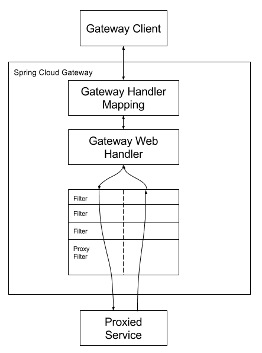

# 原理分析之如何路由

Spring Cloud Gateway通过一系列的Filter来进行数据的传输，如下图所示：

SOP网关在此基础上新增了几个Filter用来处理自己的逻辑，如：前置校验、结果返回。

| 过滤器  | 类型  | Order  | 功能                       |
| -----   | ---- | ----------------------- | ---------------------------- |
|IndexFilter| `自定义` | -2147483648 | 入口过滤器，获取参数、签名校验 |
|ParameterFormatterFilter | `自定义` | -2147482647 | 格式化参数 |
|LimitFilter|`自定义`|-2147482447|限流|
|ForwardPathFilter|系统自带|0 |设置转发的path|
|RouteToRequestUrlFilter|系统自带|10000|设置转发host|
|SopLoadBalancerClientFilter|`自定义`|10100|LoadBalance获取转发实例|
|NettyRoutingFilter|系统自带|2147483647|获取httpclient发送请求|
|ForwardRoutingFilter|系统自带|2147483647|请求分发|
|GatewayModifyResponseGatewayFilter|`自定义`|-2|处理响应结果|

一个完整的请求会自上而下经过这些Filter，下面讲解如何动态设置路由。

## 动态设置路由

网关启动后会从注册中心拉取微服务实例，然后请求微服务提供的一个接口（`/sop/routes`），获取开放接口信息（被`@Open`注解的接口）。

监听处理类在：`com.gitee.sop.bridge.route.NacosRegistryListener`

获取到路由信息后，将路由信息缓存到本地，并保存到数据库，代码在：`com.gitee.sop.gatewaycommon.gateway.route.GatewayRouteCache.load`

然后动态设置Gateway路由，代码在：`com.gitee.sop.gatewaycommon.gateway.route.GatewayRouteRepository.refresh`

当有微服务重新启动时，网关会监听到微服务实例有变更，会重复上述步骤，确保网关存有最新的路由。
